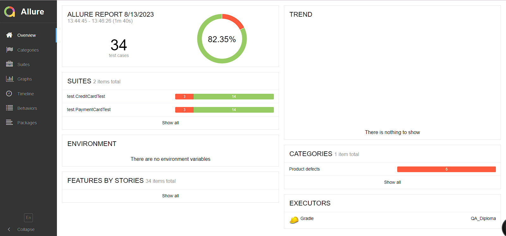
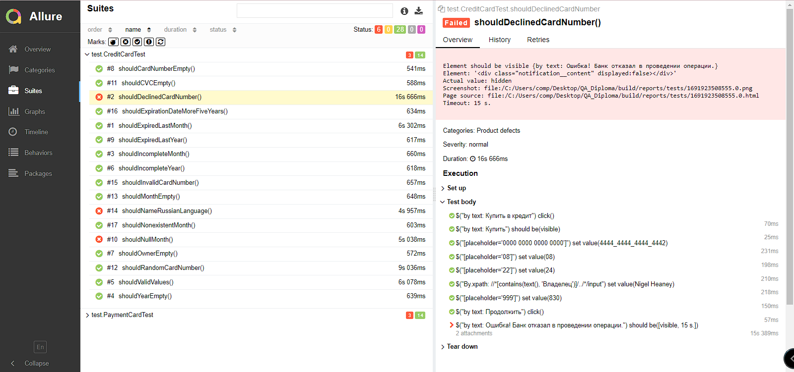
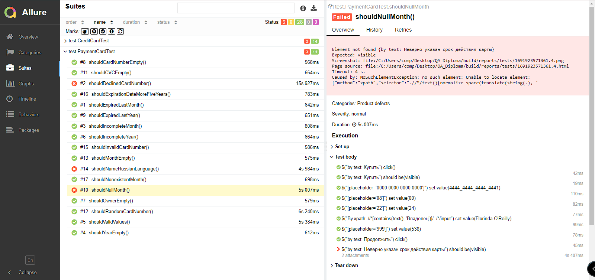

# Отчётные документы по итогам тестирования

## Описание
Произведено автоматизированное тестирование сервиса покупки тура с банковской карты и оформление тура в кредит с использованием банковской карты.
Интегрирован Allure для вывода детализированных отчетов.

Были проверены:
* возможность оплаты и отправки формы
* валидация полей
* записи данных в БД.

## Количество тест-кейсов
34 тест-кейса, из них:
* 28 тестов успешно пройдены (82,4%)
* 6 тестов провалены (17,6%)

## Общие рекомендации
1. Предоставить подробную техническую документацию для полной проверки валидности заполнения полей
2. Рекомендуется исправить код, согласно оформленным Issues по найденным багам.
3. Рекомендуется использовать уникальные селекторы в html-коде страницы покупки тура

## Allure report

**Overview**

**Suites**

